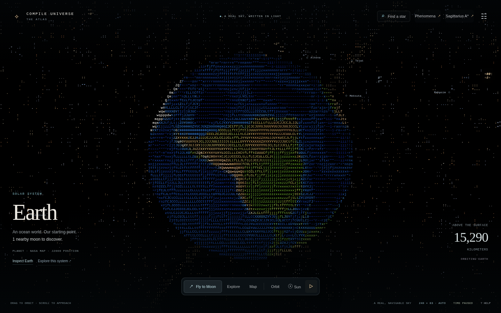
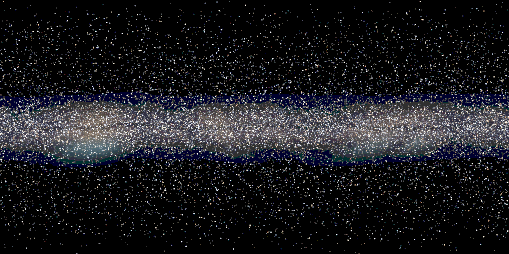
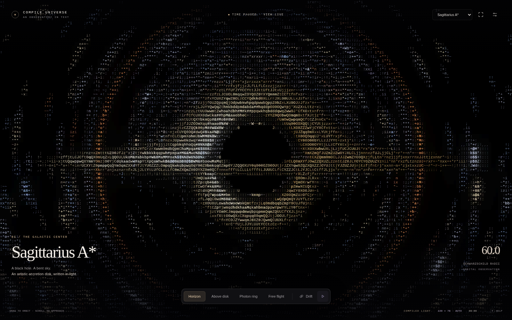
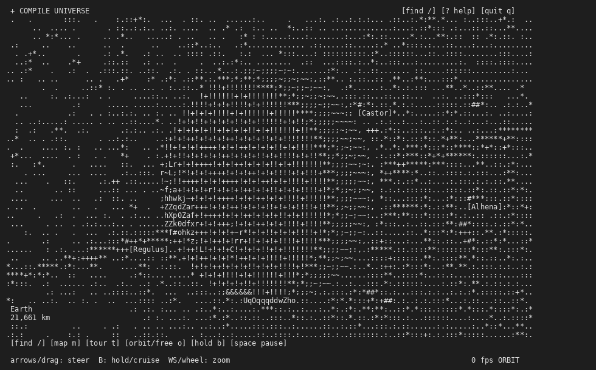
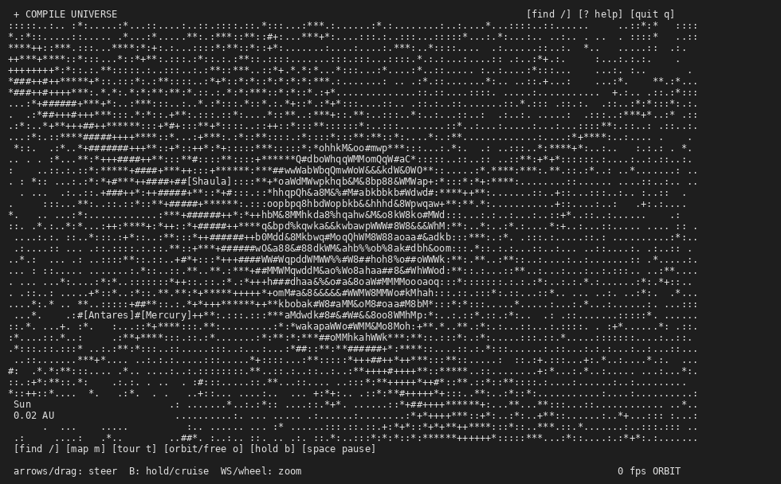

# Compile Universe

A navigable atlas of the cosmos rendered in ASCII characters. Fly from Earth to quasar 3C 273 through real star data from the Gaia DR3 catalog — 1.5 million stars within 500 light-years, plus the Large Magellanic Cloud. Every view is computed in real time by a WebAssembly scene evaluator; there are no pre-recorded paths or rendered images to convert.


*Earth viewed from orbit — city lights visible at night*


*The Milky Way galaxy as seen from within*


*Gravitational lensing around Sagittarius A*

## Terminal Experience

The same universe runs in your terminal with ANSI colors:


*Earth from orbit in the terminal version*


*The solar system in the terminal version*

## Quick Start

```bash
# Clone the repo
git clone https://github.com/BANTAM-ADMIN/compile-universe.git
cd compile-universe

# Install dependencies
python3 -m pip install -r requirements.txt

# Launch the browser atlas
python3 run.py web --backend cpu --port 8768
```

Open http://127.0.0.1:8768/ and you're in the universe.

**Terminal version:** Run `./universe-terminal` for an ANSI-colored terminal experience with the same universe.

## What You Can Do

- **Fly anywhere** — navigate to any star, planet, or deep-sky object
- **Grand Tour** — visit 19 curated destinations from Earth to quasar 3C 273
- **Real data** — Gaia DR3 star positions, JPL Horizons planetary ephemerides
- **Phenomena** — gravitational lensing, nebulae, stellar activity, comets
- **System maps** — view the solar system or any star system from above

## How It Works

Compile Universe doesn't render images and convert them to ASCII. Instead, it compiles catalog records, surface charts, and emission fields into a scene evaluator that directly computes which ASCII character belongs in each cell. The result is a true ASCII representation of the universe, not a post-processed approximation.

## Technical Details

- **Backend:** Python with WebAssembly (Wasmtime) for scene evaluation
- **Frontend:** Vanilla JS, WebGL (optional), Canvas 2D fallback
- **Data:** Gaia DR3, JPL Horizons, NASA sources
- **No server required** — runs entirely in your browser or terminal

## License

See individual data source licenses in `data/`.

## Credits

Built with real astronomical data from Gaia, JPL, NASA, and the Minor Planet Center.